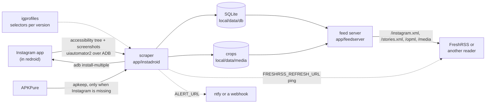

# Architecture

How the pieces fit together: what each container and package owns, how a post gets from the Instagram
app to a feed reader, where the trust boundaries sit, and where state lives. The README's
[How a scrape works](../README.md#how-a-scrape-works) has the scrape step by step, and
[PROFILES.md](PROFILES.md) the design of the per-version profiles; this page only places them.

## Contents

- [Component map](#component-map)
- [How a post reaches a reader](#how-a-post-reaches-a-reader)
- [Trust boundaries](#trust-boundaries)
- [Where state lives](#where-state-lives)
- [Weighed and not shipped](#weighed-and-not-shipped)

## Component map

Four compose services, in start order (`docker-compose.yml`'s header is the source):

| Service    | What it is                                                                                                                                                                                                                                                     |
| ---------- | -------------------------------------------------------------------------------------------------------------------------------------------------------------------------------------------------------------------------------------------------------------- |
| `init`     | One-shot, as root, from the app image: `scripts/init-data.sh`. It runs the `/data` version guard (`scripts/guard-android-data.sh`, refusing a volume last used by a different Android major version) and creates the app's data directories owned by uid 1000. |
| `redroid`  | The Android device (`ig-redroid`), privileged, Android 13 with ARM translation ([COMPATIBILITY.md](COMPATIBILITY.md)). The real Instagram app runs here. ADB on `127.0.0.1:5555`.                                                                              |
| `app`      | The scraper and the feed server (`ig-app`), two processes in one container on host networking. `app/entrypoint.sh` starts both and tears both down if either exits, so the restart policy restarts a clean pair.                                               |
| `freshrss` | Optional, only with `--profile freshrss`: a reader on `127.0.0.1:8080` ([FRESHRSS.md](FRESHRSS.md)).                                                                                                                                                           |

The Python code in `app/` is five top-level packages, with the boundaries between them enforced by
import-linter (`[tool.importlinter]` in `pyproject.toml`):

```text
app/                 the app image's build context
  scraper.py         the scraper's command line (scraper.py once, login, install, ...)
  instadroid/        the scraper (the package docstring lists its modules)
  igprofiles/        per-Instagram-version profiles (docs/PROFILES.md)
  feedserver/        the feed server, served as uvicorn feedserver:app
  shared/            the leaf both sides import: fileenv (secrets from files), sqlrows (typed SQLite rows)
  devtools/          dev commands, not in the image: new-profile, promote-dump, check-new-builds, export-openapi
tests/               the test suite
scripts/             host and device shell scripts (tune-android.sh, diagnose.sh, ...)
typings/             stubs for untyped libraries
```

- The **feed server** imports nothing from the scraper: the SQLite database and the control files are
  the only things the two processes share.
- The **scraper** doesn't import the feed server, and **`shared`** imports neither.
- **Profiles** don't import the scraper code they configure; the scraper's UI-dependent functions are
  marked `@versioned` so a profile can override them ([PROFILES.md](PROFILES.md#swapping-behavior-not-just-data)).
- **`instadroid.parsing`** stays pure (no device, network or database code), which is what lets the
  replay tests parse recorded screens ([TESTING.md](TESTING.md#tier-3-fixture-replay)).

## How a post reaches a reader



1. The scraper connects to the device over ADB with `uiautomator2`, installs Instagram if it's missing,
   and logs in when the login form shows.
2. It walks the feed screen by screen, parsing each hierarchy dump with the active profile's selectors,
   cropping media from screenshots and reading each post's permalink from the share sheet.
3. It stores posts, stories, avatars and each run's record in SQLite and the media directory, then
   pings a reader's refresh URL when something new was stored.
4. The feed server renders the database as Atom and OPML and serves the media, behind `FEED_TOKEN`
   when that's set.

## Trust boundaries

[SECURITY.md](SECURITY.md) has the threat model these sit inside and what is in and out of scope.

- **Operator ↔ Instagram credentials.** `IG_USERNAME`/`IG_PASSWORD` come from `.env` or from files
  (`*_FILE`, read by `shared.fileenv.env_secret`), and `ensure_logged_in()` types them into the login
  form on the device; the login screenshot is taken before typing. After a login the session lives on
  the device, in redroid's `/data`, not in the app.
- **Host ↔ the device.** redroid's adbd runs unauthenticated (`ro.adb.secure=0`). Compose publishes it
  only on `127.0.0.1:5555`, and the `app` container reaches it through host networking, so any process
  on the host can fully control the device and its logged-in session. redroid runs privileged, so a
  compromise of the Android container is a compromise of the host.
- **The app ↔ APKPure.** A fresh Instagram install trusts whatever APKPure serves; `apkeep` itself is
  pinned to a release and checksum in `app/Dockerfile`.
- **Feed server ↔ readers.** It binds `FEED_HOST`, loopback by default. With `FEED_TOKEN`, every path
  but `/health` needs the token, media URLs carry a per-file HMAC signature instead, and cross-site
  state-changing requests are refused (`feedserver.auth`). Without it, anyone who can reach the port
  reads everything scraped.
- **The app ↔ outbound webhooks.** `ALERT_URL` and `FRESHRSS_REFRESH_URL` can carry tokens; they're
  never logged with their query string or credentials (`instadroid.common.redact_url`).

## Where state lives

Everything the stack writes is under `local/` (gitignored), bind-mounted into the containers:

| Host path                  | In the container | Holds                                                                                                                                                                                                                |
| -------------------------- | ---------------- | -------------------------------------------------------------------------------------------------------------------------------------------------------------------------------------------------------------------- |
| `local/data/android`       | redroid `/data`  | Android's own state, the installed Instagram, and **the logged-in session**. One Android major version only ([COMPATIBILITY.md](COMPATIBILITY.md#one-android-version-per-data-volume)).                              |
| `local/data/android.image` | init `/data/…`   | The guard's marker: the redroid image that last used the volume.                                                                                                                                                     |
| `local/data/db`            | app `/db`        | `posts.sqlite` (`DB_PATH`): tables `posts`, `media`, `accounts`, `stories`, `alerts`, `following`, `runs`. Also `backups/` and the control files `manual.lock`, `needs-human.hold` and `scrape-now` (`CONTROL_DIR`). |
| `local/data/media`         | app `/media`     | Post crops and carousel slides, `avatars/` and `stories/` (`MEDIA_DIR`).                                                                                                                                             |
| `local/data/debug`         | app `/debug`     | Hierarchy dumps, screenshots, failure logcats, and `profile-dev/` captures (`DEBUG_DIR`).                                                                                                                            |
| `local/data/apk`           | app `/apk`       | The downloaded Instagram bundles, one folder per build (`APK_CACHE_DIR`).                                                                                                                                            |
| `local/data/backups`       | —                | `/data` snapshots from `scripts/snapshot-android-data.sh`, taken with redroid stopped.                                                                                                                               |
| `local/data/freshrss`      | freshrss         | FreshRSS's own data and extensions, when that service runs.                                                                                                                                                          |
| `.env`                     | app environment  | Every setting, including the credentials unless they come from files.                                                                                                                                                |

The feed server keeps no state of its own: it reads its settings once at import and everything else
from the database and the media directory. [OPERATIONS.md](OPERATIONS.md#storage-and-retention) has
retention, the size cap and backups.

## Weighed and not shipped

Designs considered and declined, kept so they aren't re-proposed without something new. Each links
to where the decision is recorded.

- **Host GPU mode for redroid**: tried as a fix for the Following-feed switcher, rejected for a tenfold
  slower boot ([COMPATIBILITY.md](COMPATIBILITY.md#weighed-and-not-shipped)).
- **One profile per Instagram version**: the first profile design, replaced by profiles only at the
  points where Instagram changed something, once 441-446 all ran on the same selectors
  ([PROFILES.md](PROFILES.md#why), [RUNLOG.md](RUNLOG.md)).
- **A versioned post identity**: `_post_key()` is deliberately not `@versioned`, so stored posts
  dedupe across Instagram upgrades ([PROFILES.md](PROFILES.md#swapping-behavior-not-just-data)).
- **Advancing through a story by tapping**: it ejected Instagram to the launcher, so only a story's
  current frame is captured ([README](../README.md#stories)).
- **Device locale and mock GPS** for fingerprint consistency: locale changes needed a system broadcast
  `adb shell` can't send, and `adb emu geo fix` doesn't work on redroid; `.env.example`'s
  `DEVICE_TIMEZONE` comment has the detail.
